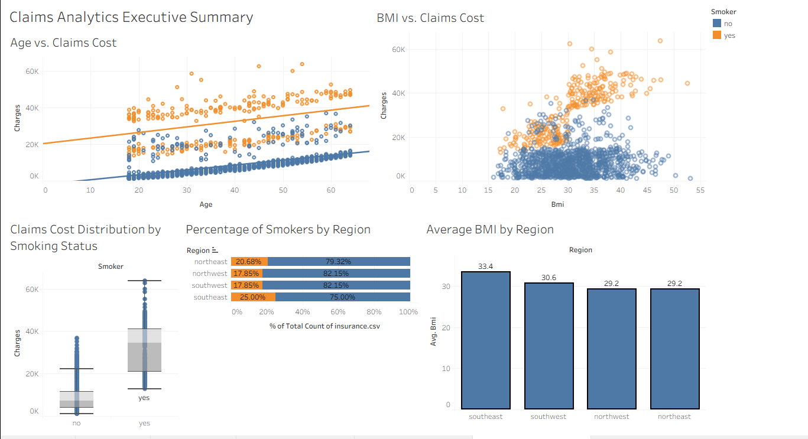
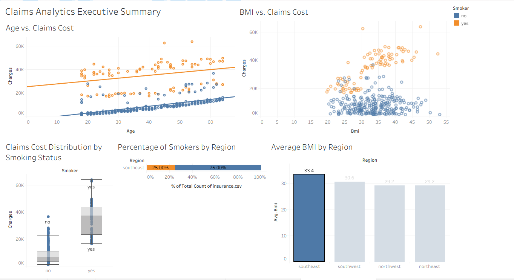

# Health-Insurance-Claims-Tableau-v2026.1.0
Health Insurance Claims Analysis with Tableau Desktop v2026.1.0, analyzing demographic and behavioral risk factors (Age, BMI, Smoking status) impacting medical insurance charges.


## Table of Contents

- [Overview](#overview)  
- [Dataset](#dataset)  
- [Technologies Used](#technologies-used)  
- [Installation](#installation)  
- [Usage](#usage)  
- [Analysis & Visualizations](#analysis--visualizations)  
- [Conclusion](#conclusion)  
- [Credits & Acknowledgements](#credits)  
- [License](#license)  

---

## Overview
- The dataset was chosen to assess health insurance claims using Tableau Desktop v2026.1.0
- The Exploratory Data Analysis mirrors the Jupyter Notebook EDA

---

## Dataset
- The dataset is Medical Cost Personal Datasets from Kaggle
- This dataset was also used in the Jupyter notebook repo
- Size of the dataset is 1338 rows and 7 columns

---

<h2>Technologies Used</h2>

<ul>
  <li><strong>Tools:</strong> Tableau Desktop v2026.1.0, VS Code, Git, GitHub</li>
 
</ul>


<P>
  
    
  
  
</p>
<p>
  
</p>


---

## Installation

Step-by-step instructions to set up the project locally:

```bash

# Clone the repository
git clone https://github.com/Kurodataio/Health-Insurance-Claims-Tableau-v2026.1.0.git

# Navigate to the project folder
cd Health-Insurance-Claims-Tableau-v2026.1.0

# Launch Tableau Desktop
Tableau Desktop 


```

## Usage

Instructions for using the project:

1. Open the tableau file (`Medical Cost Personal.twb`)  
2. Visualizations and results will be generated automatically  

---

## Analysis & Visualizations 
- **The Smoking Premium:** Smokers face significantly higher claims costs overall compared to non-smokers, regardless of age
- **The High-Risk Threshold:** A critical cost spike occurs for individuals with a BMI exceeding 30 who also smoke. 
- **Regional Consistency:** Average BMI remains relatively uniform across regions, hovering between 29 and 32.

---

## Dashboard Preview
- Insurance Claims Dashboard Preview

- Insurance Claims Dashboard Preview - Southeast Region


---

<!-- ## Interactive Live Dashboard
- **[Click here to view and interact with the Live Dashboard on Tableau Public](YOUR_TABLEAU_PUBLIC_LINK_HERE)**

--- -->

## Technical Features Demonstrated
- Interactive dashboard action filtering (Filter by region or smoking status).
- Custom Box-and-Whisker distribution analysis.
- 100% Stacked bar chart implementations utilizing quick table calculations.
- Data cleansing, type structuring, and metric aggregation management.

---
## Conclusion 

- Summarize the outcome of your analysis  
- What are the main insights or takeaways?  
- How could this analysis inform decision-making?  
- Recommendations or next steps for further analysis  

---

## Acknowledgements & Credits

- **Dataset Source:** [Kaggle → Datasets](https://www.kaggle.com/datasets/mirichoi0218/insurance)  
- **Google Gemini** [Link](https://gemini.google.com/app)  

---

## License

This project is licensed under the [MIT License](https://choosealicense.com/licenses/mit/)

---
